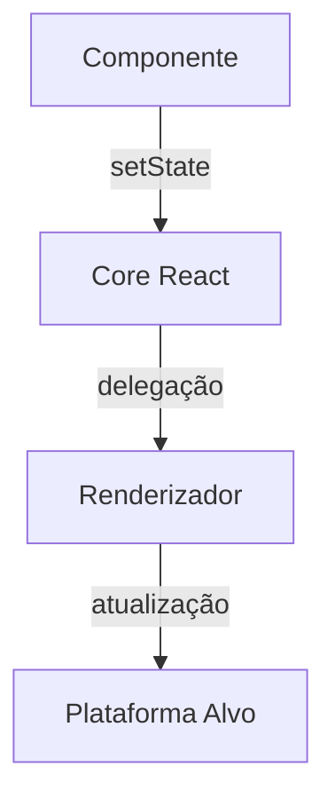

Imagine você criando um componente simples de contador:

```jsx
import { useState } from 'react';

function Contador() {
  const [count, setCount] = useState(0);

  return (
    <div>
      <p>Você clicou {count} vezes</p>
      <button onClick={() => setCount(count + 1)}>
        Incrementar
      </button>
    </div>
  );
}
```

Ao clicar no botão, o estado é atualizado e a interface reflete a mudança. Mas o que realmente acontece nos bastidores quando chamamos `setCount`? A resposta revela a arquitetura poderosa por trás do React.

## A Ilusão da Simplicidade

O React cria uma abstração que nos permite pensar em componentes de forma declarativa. Porém, sob o capô, existe um complexo sistema de coordenação entre:

1. **Core React (react):** Define componentes e APIs básicas
2. **Renderizadores (react-dom, react-native):** Implementam a lógica específica de plataforma
3. **Reconciliador:** Gerencia a diferença entre árvores virtuais

## O Mecanismo de Atualização

Quando chamamos `setState` (em classes) ou funções de atualização de Hook, ocorre um processo em 3 etapas:

1. **Enfileiramento:** A atualização é adicionada a uma fila de tarefas
2. **Reconciliação:** O React calcula a nova árvore virtual
3. **Commit:** O renderizador aplica as mudanças na plataforma alvo

### O Papel Crucial dos Renderizadores

Cada renderizador implementa seu próprio **mecanismo de atualização**:

```javascript
// Exemplo simplificado de implementação no React DOM
const ReactDOMUpdater = {
  enqueueSetState(componente, partialState) {
    // 1. Mescla o estado parcial
    // 2. Agenda nova renderização
    // 3. Notifica o reconciliador
    scheduleWork(componente, partialState);
  }
};
```

## A Magia da Injeção de Dependência

O React usa um padrão de projeto inteligente para conectar componentes aos renderizadores:

```javascript
class ComponenteReact {
  constructor() {
    // O renderizador define este campo!
    this.updater = null;
  }

  setState(estadoParcial) {
    this.updater.enqueueSetState(this, estadoParcial);
  }
}

// Durante a montagem no React DOM:
const instancia = new MeuComponente();
instancia.updater = ReactDOMUpdater;
```

Isso explica como o mesmo `setState` funciona em diferentes ambientes:

| Ambiente        | Renderizador         | Responsabilidade               |
|-----------------|----------------------|---------------------------------|
| Navegador       | react-dom            | Atualiza DOM                   |
| Mobile          | react-native         | Atualiza views nativas         |
| Testes          | react-test-renderer  | Gera snapshots                 |
| Renderização SSR| react-dom/server     | Produz HTML estático           |

## Hooks: A Evolução do Padrão

Com a introdução dos Hooks, o mecanismo evoluiu mas mantém a mesma filosofia:

```javascript
let DispatcherAtual = null;

function useState(estadoInicial) {
  return DispatcherAtual.useState(estadoInicial);
}

// Durante a renderização:
function renderizarComponente(Componente) {
  const dispatcherAnterior = DispatcherAtual;
  DispatcherAtual = ReactDOMDispatcher;
  
  try {
    return Componente(props);
  } finally {
    DispatcherAtual = dispatcherAnterior;
  }
}
```

Isso permite que diferentes renderizadores forneçam suas próprias implementações de Hooks.

## Casos de Uso Complexos

### Atualizações Assíncronas
```jsx
function ContadorComplexo() {
  const [count, setCount] = useState(0);

  const incrementoTriplo = () => {
    setCount(c => c + 1); // Atualização 1
    setCount(c => c + 1); // Atualização 2
    setTimeout(() => {
      setCount(c => c + 1); // Atualização 3
    }, 1000);
  };

  return <button onClick={incrementoTriplo}>Count: {count}</button>;
}
```

1. As duas primeiras atualizações são **agrupadas**
2. A terceira (em setTimeout) roda em **separado**
3. Isso ocorre por causa do **contexto de execução** do React

### Otimizações Avançadas
```javascript
// Implementação real simplificada no React DOM
function scheduleUpdateOnFiber(fiber, lane) {
  if (isBatchingUpdates) {
    // Adiciona à fila de atualizações
    enqueueUpdate(fiber, lane);
  } else {
    // Executa imediatamente
    performSyncWorkOnRoot(root);
  }
}
```

## Lições Arquiteturais

1. **Separação de preocupações:** O core do React não conhece plataformas
2. **Extensibilidade:** Novos renderizadores podem ser criados
3. **Performance:** Lógica específica por plataforma permite otimizações
4. **Consistência:** Mesma API para diferentes ambientes

## Desafios na Prática

1. **Versionamento:** React e react-dom devem ser compatíveis
2. **Renderizadores Múltiplos:** Integrações complexas (ex: React Three Fiber)
3. **Ambientes Exóticos:** Uso em IoT, realidade virtual, etc



## O Futuro das Atualizações

Com o React Server Components e recursos como transições, o mecanismo de atualizações continua evoluindo:

1. **Priorização:** Atualizações urgentes vs não urgentes
2. **Hydration Progressivo:** Carregamento parcial de componentes
3. **Streaming SSR:** Envio progressivo de HTML

## Conclusão

Entender a arquitetura interna do React não é essencial para uso diário, mas revela:

- A importância dos padrões de projeto bem aplicados
- Como o React mantém consistência entre plataformas
- O cuidado na abstração de complexidade

Na próxima vez que você chamar `setState`, lembre-se que está acionando um mecanismo cuidadosamente orquestrado que equilibra performance, flexibilidade e simplicidade de uso.

